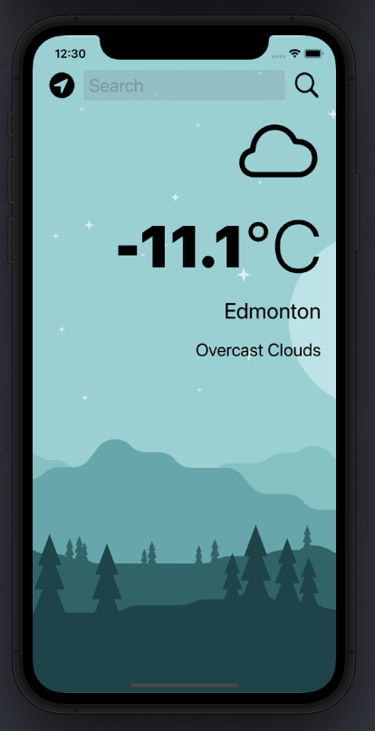

#  ClimateApp


A beautiful, dark-mode enabled weather app. You'll be able to check the weather for the current location based on the GPS data from the iPhone as well as by searching for a city manually. 

<p float = "left" padding = 30px>



</p>

## What I learned


* delegate pattern.
* Swift protocols and extensions. 
* Swift guard keyword. 
* Swift computed properties.
* Swift closures and completion handlers.
* Learned to use URLSession to network and make HTTP requests.
* Parse JSON with the native Encodable and Decodable protocols. 
* Learned to use Grand Central Dispatch to fetch the main thread.
* Learned to use Core Location to get the current location from the phone GPS. 

### Condition Codes
```
switch conditionID {
        case 200...232:
            return "cloud.bolt"
        case 300...321:
            return "cloud.drizzle"
        case 500...531:
            return "cloud.rain"
        case 600...622:
            return "cloud.snow"
        case 701...781:
            return "cloud.fog"
        case 800:
            return "sun.max"
        case 801...804:
            return "cloud.bolt"
        default:
            return "cloud"
        }

